# **End User Manual**
## **ผู้เช่าที่จอดรถ (Renter)**
### **ขั้นตอนการลงทะเบียนสำหรับผู้ใช้ใหม่**

&emsp;ผู้ใช้ใหม่ทุกคนต้องทำการลงทะเบียน สำหรับการจองที่จอดรถ หากไม่ทำการลงทะเบียน หรือยังไม่มีบัญชีผู้ใช้ จะไม่สามารถจองที่จอดรถได้ สามารถทำได้เพียงแค่ดูที่จอดรถเท่านั้น
1. เลือกลงทะเบียนที่มุมขวาบนของหน้าเว็บ
2. กรอกข้อมูลตามที่เว็บแสดงให้กรอก 
3. อ่านเงื่อนไขและข้อกำหนดการใช้งาน
4. เสร็จแล้วเลือกปุ่มลงทะเบียน เพื่อทำการยืนยันการลงทะเบียน

### **ขั้นตอนการใช้ PAKU**
1. เข้าสู่ระบบ โดยใช้บัญชีที่ได้ลงทะเบียนไว้เพื่อเข้าสู่ระบบ 
2. เมื่อเข้าสู่ระบบสำเร็จจะเข้าสู่หน้าแรกของเว็บ 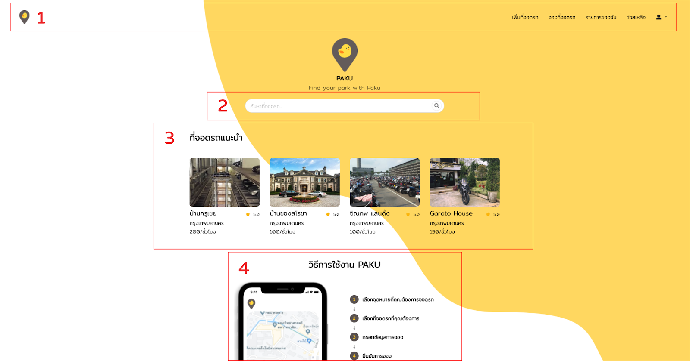

__ส่วนที่ 1 Menu bar__  จะแสดงเมนูใช้งานของผู้ใช้ โดยเมื่อเลือกที่ไอคอน PAKU จะกลับมาหน้าแรกเสมอ ผู้ใช้สามารถจองที่จอดจากส่วนนี้ที่เมนู ‘จองที่จอดรถ’ โดยจะแสดงที่จอดรถใกล้คุณจากการระบุตำแหน่ง และเมื่อเลือกที่จอดรถแล้ว ระบบจะทำการเปลี่ยนหน้าให้ไปทำการจองได้เลย

__ส่วนที่ 2 ค้นหาที่จอดรถ__ ผู้ใช้สามารถค้นหาที่จอดรถได้จากส่วนที่ 2 โดยใช้คำค้นหาได้ทั้งชื่อตำแหน่งของสถานที่ เช่น สยาม อนุสาวรีย์ชัยสมรภูมิ ฯลฯ  หรือชื่อที่จอดรถ ในกรณีที่ผู้ใช้ทราบชื่อจอดรถ เช่น บ้านครูเชย

__ส่วนที่ 3 ที่จอดรถแนะนำ__ ในส่วนนี้จะแสดงที่จอดรถแนะนำจากตำแหน่งสถานที่ต่างๆ โดยจะแนะนำจากเรตติ้งหรือระดับความพึงพอใจของผู้ใช้ที่เคยใช้บริการ

__ส่วนที่ 4 วิธีการใช้งาน PAKU__ ในส่วนนี้เป็นวิธีการจองแบบคร่าวๆ

### **ขั้นตอนการจองที่จอดรถ**
1. ป้อนตำแหน่งสถานที่ที่ต้องการใช้บริการ 
2. ระบบจะนำมาสู่หน้านี้ โดยผู้ใช้สามารถดูตำแหน่ง หรือระบุตำแหน่งเพิ่มโดย Google map โดย Google map จะแสดงที่จอดรถทั้งหมด และ ‘ที่จอดใกล้สถานที่ที่คุณเลือก’  เป็นตัวเลือกของที่จอดรถแนะนำ 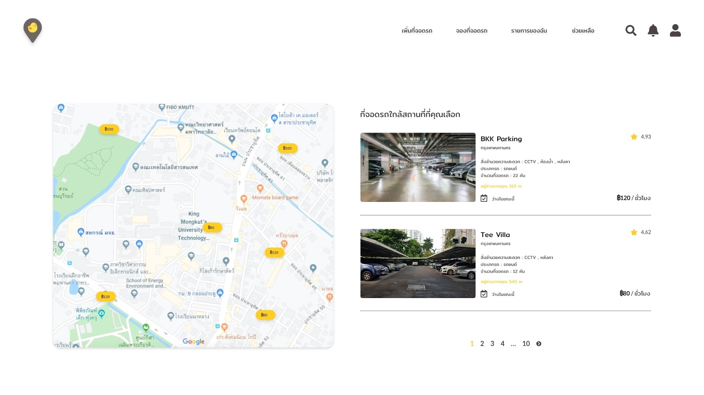

**ตัวอย่าง :** การจองที่จอดรถ บ้านครูเชย 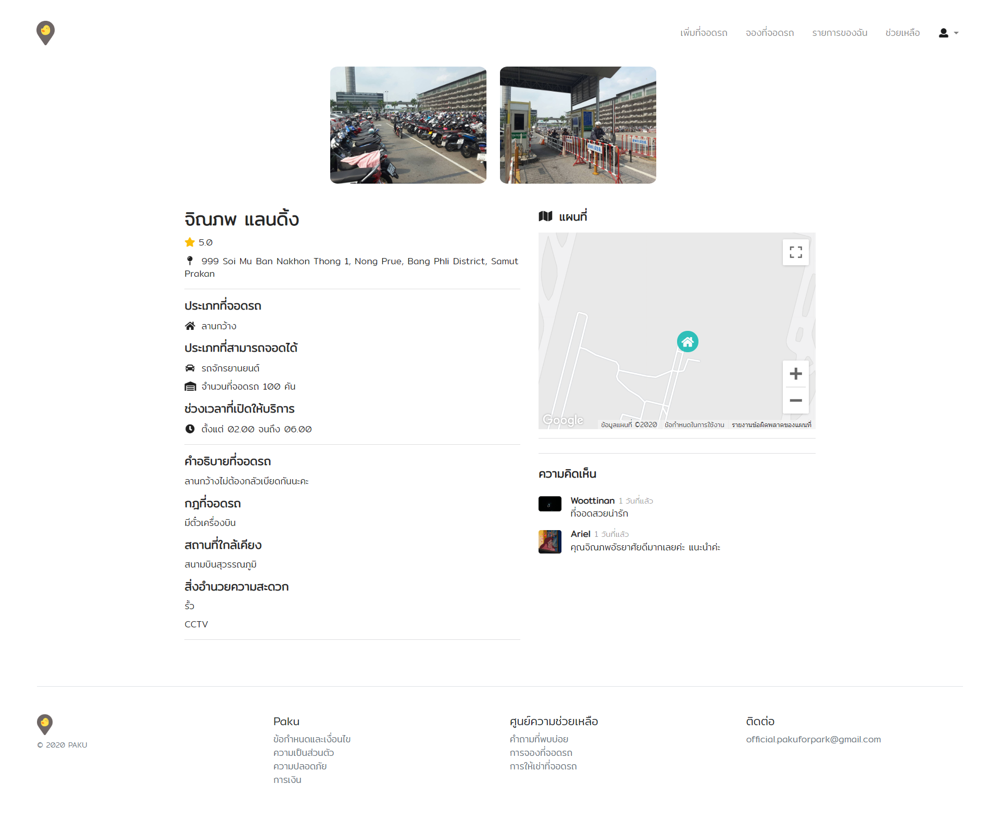
**ส่วนที่ 1, 2 และ 3** เป็นส่วนที่แสดงข้อมูลของสถานที่ให้เช่า โดยส่วนที่ 1 แสดงรูปที่จอดรถ ส่วนที่ 2 แสดงรายละเอียดข้อมูลเกี่ยวกับที่จอดรถ และส่วนที่ 3 แสดงรีวิวของผู้ที่เคยมาใช้บริการ  
**ส่วนที่ 4** เป็นส่วนที่ผู้ใช้ต้องกรอกรายละเอียดเกี่ยวกับการจอง โดยระบบจะทำการประมวลผลจำนวนชั่วโมง และคำนวณราคาให้ผู้ใช้

3. กรอกข้อมูลในส่วนที่ 4 เมื่อกรอกเสร็จแล้ว กดจองทันทีที่ปุ่มสีเหลือง
4. เมื่อทำการจองเสร็จแล้ว ผู้ใช้สามารถดูรายการที่จองได้จาก ‘รายการของฉัน’ จาก Menu bar

### การเช็คอิน-เอาท์ 
&emsp;ในส่วนนี้ เป็นส่วนหลังจากที่ทำรายการจองเสร็จแล้ว เมื่อผู้ใช้เข้าใช้บริการตามที่ได้กรอก

1. เลือกรายการของฉันในส่วน Menu bar 
2. เลือก ‘การจอง’

3. ผู้ใช้ต้องทำการเช็คอิน เมื่อผู้ใช้เริ่มใช้บริการเช่าที่จอดรถ โดยการคลิกปุ่ม ‘เช็คอิน’ เพื่อทำการยืนยันการเข้าใช้บริการ 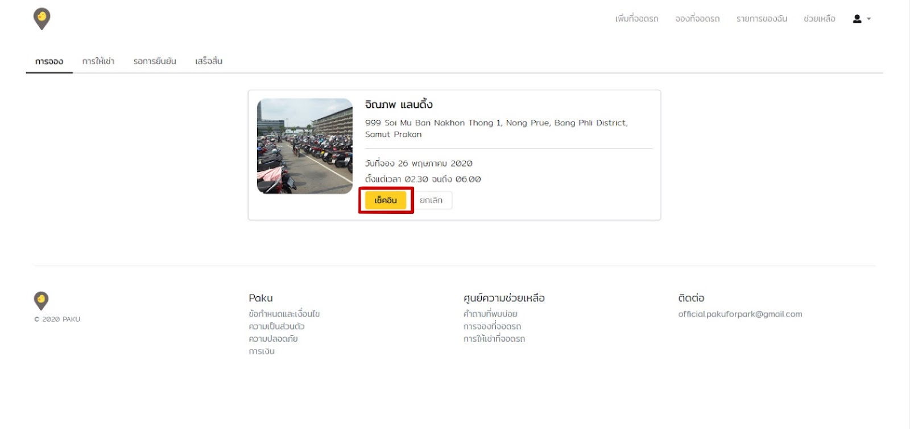
4. ผู้ใช้จะต้องรอให้เจ้าของที่จอดรถกดยืนยันก่อน การจองที่จอดรถจึงจะเสร็จสมบูรณ์ 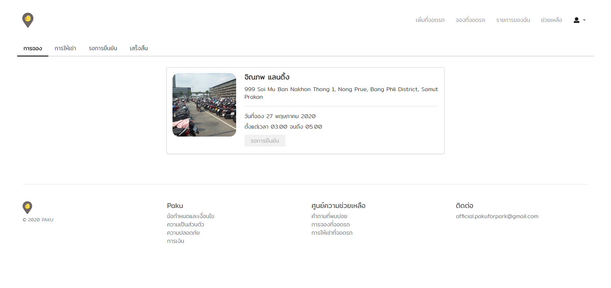
5. ผู้ใช้ต้องทำการเช็คเอาท์ หลังจากใช้บริการเช่าที่จอดรถครบตามจำนวนเวลาที่จอง โดยการคลิกปุ่ม ‘เช็คเอาท์’ เพื่อเป็นการยืนยันว่าผู้ใช้ ใช้บริการครบตามจำนวนเวลา และถ้าหากผู้ใช้ทำการ เช็คเอาท์ เกินเวลา ผู้ให้เช่าสามารถคิดค่าปรับเกินเวลาได้ 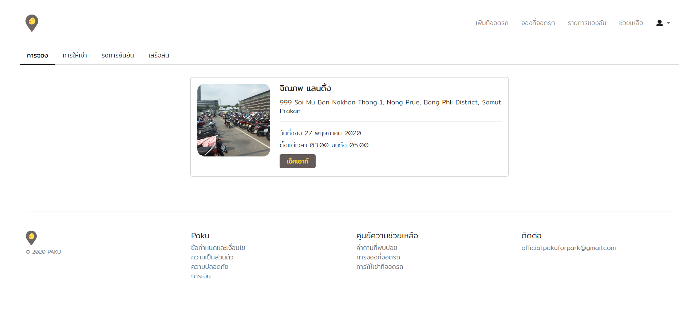
**หมายเหตุ** : ถ้าหากผู้ใช้ เช็คอินและเช็คเอาท์เลยเวลาที่ทำการจอง ****

### **การยกเลิกการจอง**
&emsp;หากผู้ใช้ต้องการยกเลิกรายการที่จอง สามารถทำได้ดังนี้
1. เลือกรายการของฉันในส่วน Menu bar
2. เลือก ‘การจอง’
3. เลือกรายการจองที่ต้องการยกเลิก 
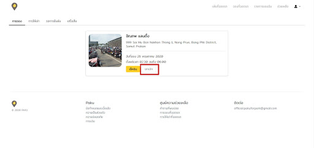
4. เมื่อทำการยกเลิกเสร็จแล้ว ระบบจะทำการย้ายรายการที่ยกเลิกแล้วไปหน้า ‘ยกเลิกแล้ว’ ผู้ใช้สามารถเข้าไปดูประวัติการยกเลิกได้

### **การให้เรตติ้งและการรีวิว**
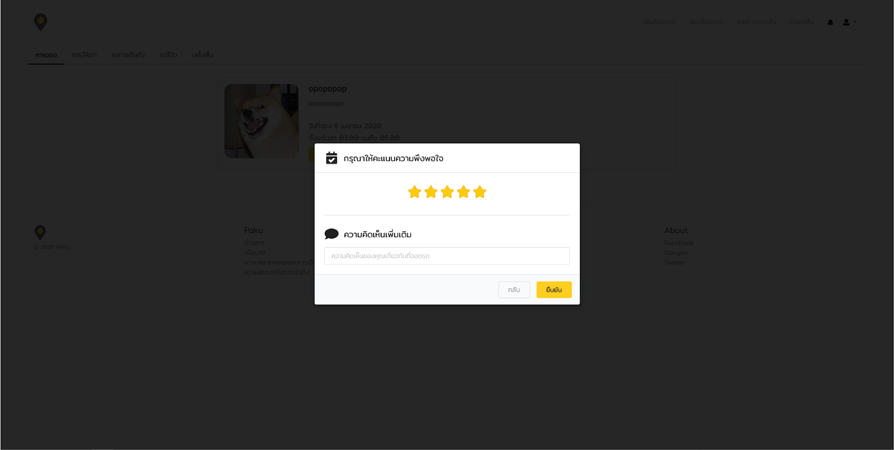
การให้เรตติ้ง 
&emsp;เมื่อผู้ใช้ทำการ Check out การจองเรียบร้อยแล้ว ระบบจะทำการแสดงคะแนนให้ผู้ใช้ให้คะแนน หรือการให้เรตติ้ง โดยส่วนนี้ระบบจะบังคับให้ผู้ใช้ให้เรตติ้ง หลังการ Check out โดยที่ผู้ใช้ไม่สามารถกดข้ามหรือไว้ก่อนได้ ถ้าผู้ใช้ไม่ทำการให้คะแนน จะถือว่ายังไม่ได้ทำการ Check out

การรีวิว 
&emsp;ผู้ใช้สามารถแสดงความคิดเห็นเพิ่มเติมได้จากหน้านี้ โดยที่ระบบไม่บังคับให้แสดงความคิดเห็น ผู้ใช้สามารถเลือกได้ว่า จะแสดงความคิดเห็น หรือข้ามส่วนการแสดงความคิดเห็นเพิ่มเติม

&emsp;ในส่วนนี้ ไม่ว่าผู้ใช้จะแสดงความคิดเห็นหรือไม่ก็ตาม ผู้ใช้ต้องให้คะแนนความพึงพอใจ และ**อย่าลืมกดยืนยัน** มิเช่นนั้นจะถือว่าการให้คะแนน และการ Check out เป็นโมฆะ และผู้ใช้จะต้องจ่ายค่าปรับ เนื่องจาก Check out เกินเวลา

## **เจ้าของที่จอดรถ (Lessor)**
&emsp;หากท่านต้องการเป็นเจ้าของที่จอดรถ หลังจากท่านลงทะเบียนเป็นผู้ใช้งานแล้ว ท่านจะต้อง <u>**“ยืนยันตัวตน”**</u> ให้กับระบบก่อน  

โดยมีขั้นตอนการยืนยันตัวตนดังนี้
1. กรอกเลขบัตรประจำตัวประชาชน และเลขหลังบัตรประชาชนของท่าน
2. อัปโหลดรูปภาพด้านหน้าบัตรประจำตัวระชาชน
3. อัปโหลดรูปตัวท่าน ถ่ายภาพคู่กับ บัตรประจำตัวประชาชน
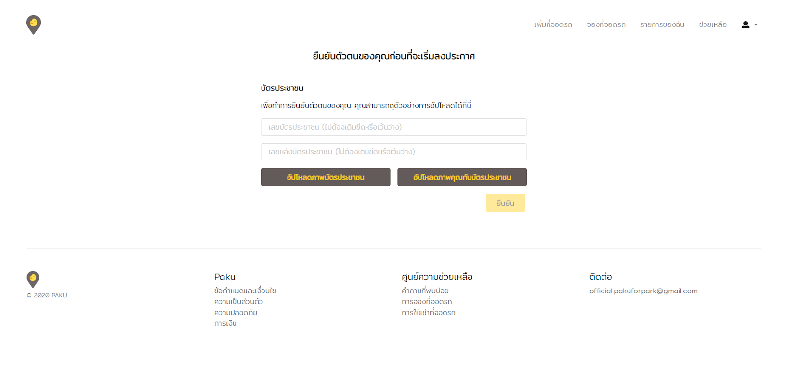

หลังจากท่านทำการยืนยันตัวตนแล้ว หลังจากท่านทำการยืนยันตัวตนแล้ว ท่านจะต้องรอให้<ins>ระบบ</ins>อนุมัติก่อน จึงจะสามารถประกาศให้เช่าที่จอดรถได้ 
### **การประกาศให้เช่าที่จอดรถ**
&emsp;หลังจากที่ท่านได้รับการอนุมัติจากระบบให้ประกาศที่จอดรถได้ เมื่อเข้าสู่ระบบแล้วจะเป็นดังภาพ
1. ให้ท่านเลือก “เพิ่มที่จอดรถ” ใน Menu bar
2. จากนั้นท่านจะต้องกรอกรายละเอียดทั้งหมดซึ่งแบ่งออกเป็น 3 ส่วนดังภาพ  
    - <u>**ส่วนที่ 1**</u> ประกอบด้วย ชื่อที่จอดรถ ตำแหน่งที่จอดรถโดยระบุจาก Google Map ประเภทที่จอดรถ จำนวนที่จอดรถ ประเภทรถที่ท่านสามารถจอดรถได้ และเวลาที่เปิดให้บริการ 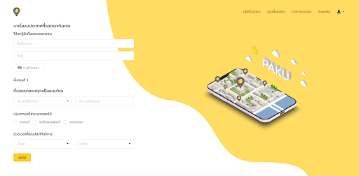
    - <u>**ส่วนที่ 2**</u> ประกอบด้วย คำอธิบายของที่จอดรถที่ผู้ใช้ควรทราบ กฎของที่จอดรถ(ไม่บังคับ) สถานที่ใกล้เคียงของที่จอดรถ และสิ่งอำนวยความสะดวกในที่จอดรถ 
    - <u>**ส่วนที่ 3**</u> ประกอบด้วย ราคาของที่จอดรถ และรูปภาพของที่จอดรถ
3. เลือก “ประกาศ” เพื่อเป็นการยืนยัน 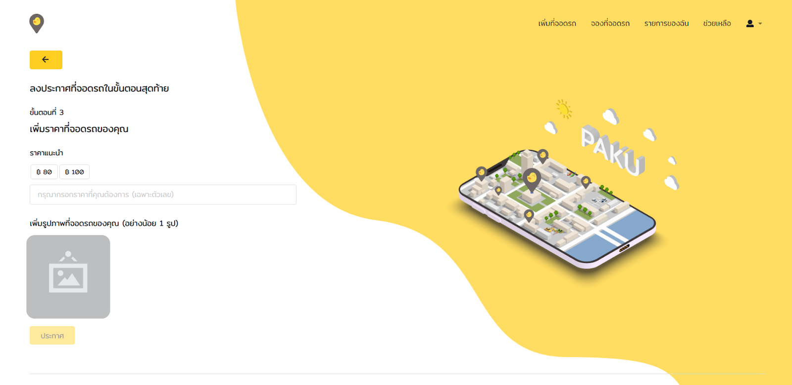

### **ที่จอดรถของท่าน**
&emsp;เมื่อลงประกาศสำเร็จแล้วท่านจะสามารถเห็นที่จอดรถของท่านทั้งหมดดังภาพ โดยมีตัวเลือกให้เลือกคลิกดังนี้ 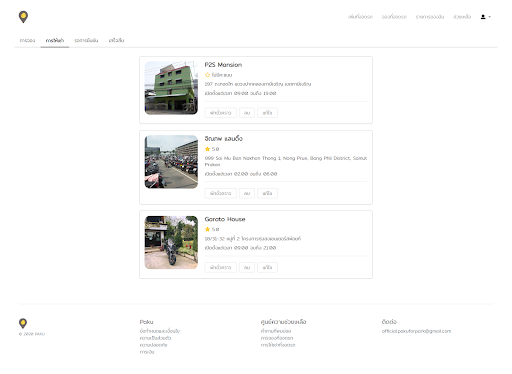
- <u>พักชั่วคราว</u> เมื่อท่านไม่สะดวกให้บริการที่จอดรถในบางช่วงเวลา
- <u>ลบ</u> ลบที่จอดรถที่ท่านไม่ต้องการให้บริการแล้ว
- <u>แก้ไข</u> แก้ไขข้อมูลของที่จอดรถที่ท่านได้กรอกไปทั้ง 3 ส่วน ก่อนหน้านี้
### **การยืนยันจองที่จอดรถ**
&emsp;ในเมนูรอการยืนยัน เมื่อมีผู้เช่าที่จอดต้องการจองที่จอดรถของท่าน ท่านจะต้องกด <u>**“ยืนยัน”**</u> เพื่อเป็นการรับทราบให้ผู้เช่ามาจองที่จอดรถของท่านได้ 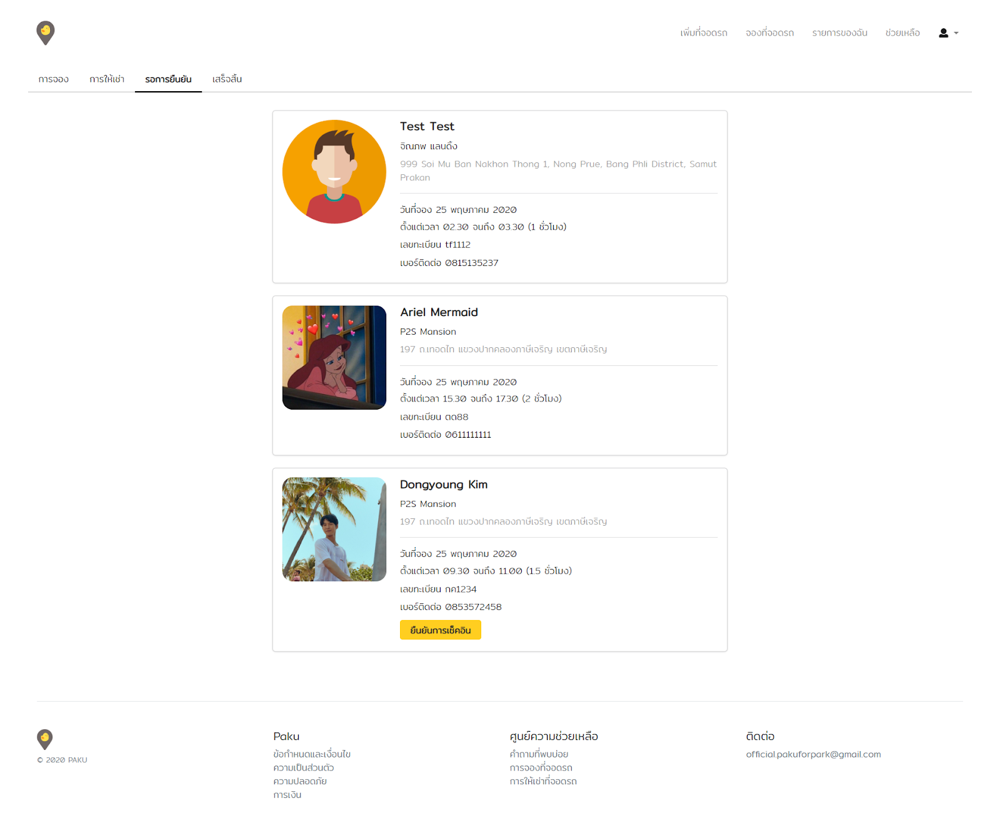

# **System Administrators Manual**
### **System Administrators**
1. เข้าไปที่ [PAKU](https://paku-cef3a.web.app/) โดยใช้บัญชีของ admin เพื่อเข้าสู่ระบบ 
2. เมื่อเข้าสู่ระบบสำเร็จจะเข้าสู่หน้า System Administrators page  

**ส่วนที่ 1 Menu bar** จะแสดงเมนูในการใช้งานของผู้ดูแลระบบ ทั้งการจัดการผู้ใช้งาน การรอการยืนยันตัวตนของผู้ใช้งาน รวมถึงการออกจากระบบ  

**ส่วนที่ 2** จะแสดงเมนูของหมวดหมู่ของผู้ใช้งานตามการยืนยันตัวตนของผู้ใช้งาน ประกอบไปด้วย 4 เมนูดังนี้
- <u>*ทั้งหมด*</u>  แสดงรายชื่อผู้ใช้งานและรายละเอียดของผู้ใช้งานทั้งหมดในระบบ
- <u>*ยืนยันแล้ว*</u>  แสดงรายชื่อผู้ใช้งานและรายละเอียดของผู้ใช้งานในระบบเฉพาะผู้ใช้ที่ได้รับการยืนยันตัวตนแล้ว
- <u>*รอการยืนยัน*</u>  แสดงรายชื่อผู้ใช้งานและรายละเอียดของผู้ใช้งานในระบบเฉพาะผู้ใช้ที่ยังไม่ได้รับการยืนยันตัวตน
- <u>*ไม่ยืนยัน*</u>  แสดงรายชื่อผู้ใช้งานและรายละเอียดของผู้ใช้งานในระบบเฉพาะผู้ใช้ที่ไม่ผ่านการยืนยันตัวตน

**ส่วนที่ 3** จะแสดงรายชื่อและรายละเอียดของผู้ใช้งานทั้งหมดตามเมนูที่เลือกในส่วนที่ 2
### **การอนุมัติผู้ใช้งาน (Approve user)**
1. เลือก **รอการยืนยันตัวตน**
2. เลือกผู้ใช้งานที่ต้องการยืนยันตัวตน แล้วคลิก **Inspect**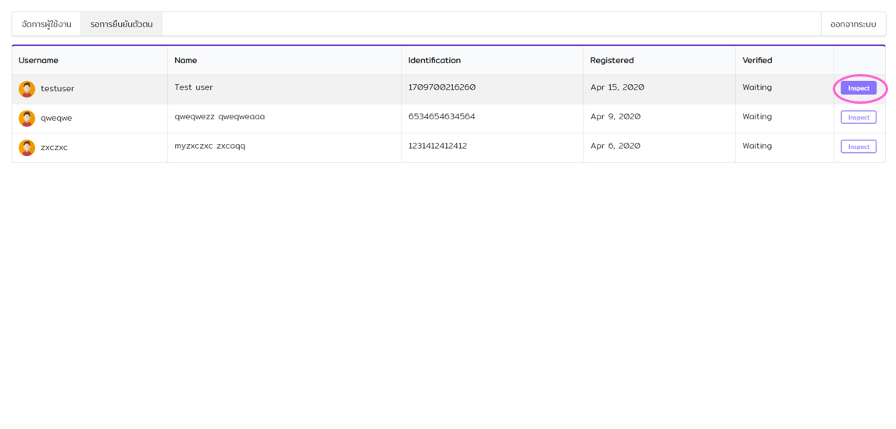 
3. เมื่อคลิก Inspect จะแสดงรายละเอียดข้อมูลผู้ใช้รายที่เลือก โดยมีตัวเลือกให้เลือกคลิกดังนี้ 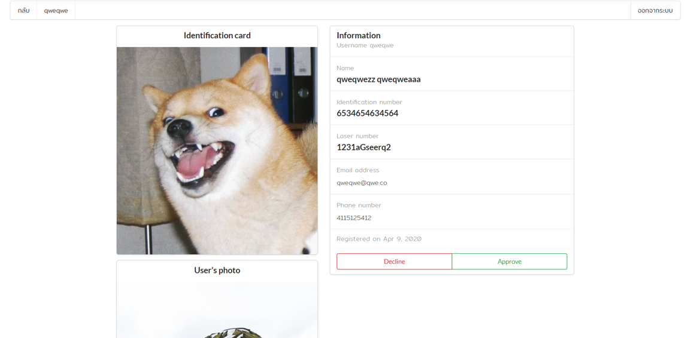 
    1. Approve เป็นการ<u>ยอมรับ</u>ให้ผ่านการยืนยันตัวตนของผู้ใช้
    2. Decline เป็นการปฏิเสธไม่ให้ผ่านการยืนยันตัวตน

### **การลบผู้ใช้งาน (Delete user)**
1. เลือก **จัดการผู้ใช้งาน**
2. เลือกผู้ใช้งานที่ต้องการลบออกจากระบบ คลิก **Delete**  
3. เมื่อคลิก Delete จะแสดงชื่อผู้ใช้รายที่เลือก และมีตัวเลือกให้เลือกดังนี้
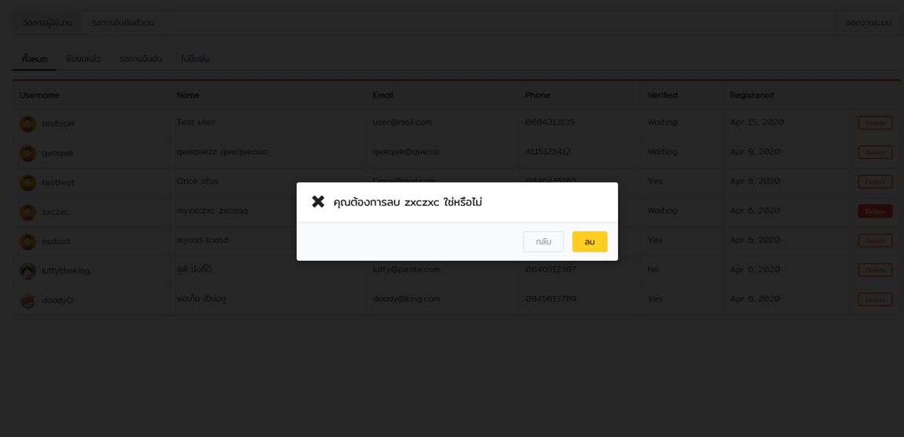
    1. <u>**ลบ**</u> เพื่อ<u>**ยืนยัน**</u>การลบผู้ใช้รายที่เลือกออกจากระบบ
    2. <u>**กลับ** </u>เพื่อ<u>**ยกเลิก**</u>การลบผู้ใช้รายที่เลือกและกลับเข้าสู่หน้าจัดการผู้ใช้งาน  